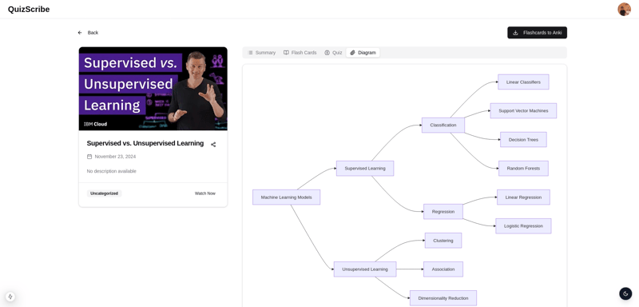

#  QuizScribe  
  
  


**QuizScribe** is your gateway to smarter learning. This innovative platform transforms YouTube videos into interactive courses, allowing you to actively engage with content through summaries, flashcards, quizzes, and diagrams. Powered by cutting-edge AI technologies like **AssemblyAI**, QuizScribe redefines how knowledge is absorbed and retained, making learning more engaging and efficient.

---


---
## 🚀 **Features**
- **Summaries**: Quickly review the key points of any video.
- **Flashcards**: Automatically generate study cards and export them to Anki for extended learning.  
- **Quizzes**: Test your knowledge with personalized, AI-generated multiple-choice questions.  
- **Diagrams**: Visualize and simplify complex concepts.  
- **Folders**: Organize videos by topic, theme, or personal goals.  
- **Browser Extension**: Seamlessly transform any YouTube video into a learning tool with a single click.

---
## 🌐 **Quick Links**
- **Chrome Extension Repository**: [QuizScribe Chrome Extension](https://github.com/ismaildrs/quizscribe-extention)  
- **Blog Post**: [QuizScribe on Dev.to](https://dev.to/ismail_drissi_32520264908/quizscribe-turning-youtube-videos-into-interactive-learning-tools-4l7g)

---
## 🛠️ **Setup and Installation**
### Requirements
- [Node.js](https://nodejs.org/en/)  
- [Next.js](https://nextjs.org/)

### Getting Started
1. Clone the repository:  
   ```bash
   git clone https://github.com/ismaildrs/quizscribe.git
   cd quizscribe
   ```
2. Install dependencies:  
   ```bash
   npm install
   ```
3. Set up environment variables:  
   Create a `.env` file in the root directory with the following values:  
   ```
   AUTH_SECRET=<your_auth_secret>
   AUTH_GOOGLE_ID=<your_google_client_id>
   AUTH_GOOGLE_SECRET=<your_google_client_secret>
   ASSEMBLYAI_API_KEY=<your_assemblyai_api_key>
   GROQAI_API_KEY=<your_groqai_api_key>
   YOUTUBE_API_KEY=<your_youtube_api_key>
   DATABASE_URL=<your_mongodb_connection_string>
   ```
   **Variable Details**:
   - **AUTH_SECRET**: A secure key for authentication.
   - **AUTH_GOOGLE_ID** and **AUTH_GOOGLE_SECRET**: Obtain from Google Cloud Console under OAuth 2.0.
   - **ASSEMBLYAI_API_KEY**: Create an account at [AssemblyAI](https://www.assemblyai.com/).
   - **GROQAI_API_KEY**: Sign up at [GROQAI](https://console.groq.com/keys) for API access.
   - **YOUTUBE_API_KEY**: Enable the YouTube Data API in [Google Cloud Console](https://console.cloud.google.com/).
   - **DATABASE_URL**: Your MongoDB connection string, available on [MongoDB Atlas](https://www.mongodb.com/atlas/database).

4. Configure the database:  
   Run these Prisma commands to synchronize your schema:  
   ```bash
   npx prisma generate
   npx prisma db push
   ```
5. Start the development server:  
   ```bash
   npm run dev
   ```
6. Open the app in your browser: [http://localhost:3000](http://localhost:3000).

---
## 🧑‍💻 **About Us**
Created with passion by:  
<a href="https://github.com/ismaildrs/quizscribe/graphs/contributors">
  
</a>


Together, we aim to make online learning smarter, more engaging, and more accessible.
